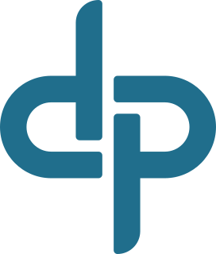
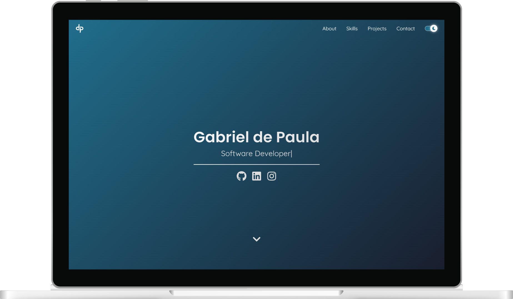
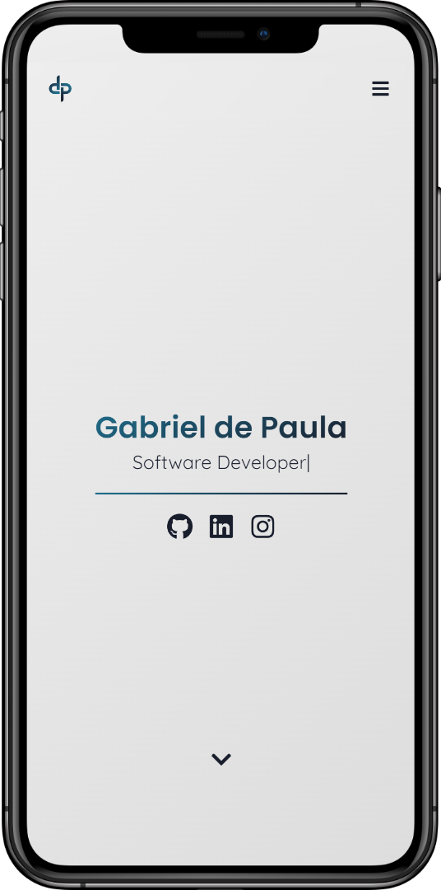

<h1>
    <p align=center>
        
    </p>
</h1>

<p align=center>
    <a href='https://gabriel-dp.github.io/'>gabriel-dp.github.io</a>
    <br/><br/>
    
    &nbsp;
    
    &nbsp;
    
</p>

&nbsp;

<p align=center>
    
    &nbsp;&nbsp;&nbsp;&nbsp;
    
</p>

&nbsp;

## 💡 Motivation

This portfolio aims to showcase some of my past and future works as a Software Developer.

You will be able to follow the improvement of projects over time and also get to know a little about me.

This is the second version of my personal page, cleaner and more professional.

> See the old version [here](https://github.com/gabriel-dp/gabriel-dp.github.io_v1)

&nbsp;

## ✨ Features

- [x] 🌙 Light/Dark mode
- [x] 📱Responsive layout
- [x] 🪪 Professional resume
- [x] 🌐 Projects synced with GitHub
- [x] 🔠 Multi-language support

&nbsp;

- [ ] 🔍 Efficient SEO

&nbsp;

## 🖥️ Running the project

Clone the repository

```bash
git clone https://github.com/gabriel-dp/gabriel-dp.github.io/
```

Install the dependencies

```bash
npm install
```

Run locally

```bash
npm run dev
```
